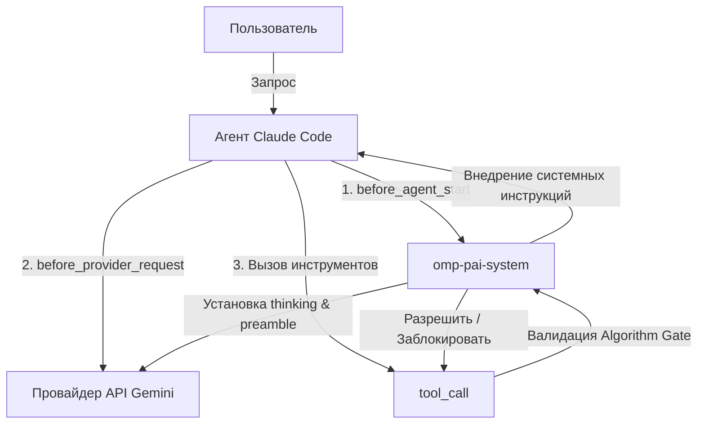

# omp-pai-system

Portable runtime для PAI, Algorithm, TELOS и MEMORY в Oh My Pi (OMP).

Текущая версия: `0.1.0`.

## Возможности

- Инициализирует локальные `TELOS`, `MEMORY` и PAI-шаблоны без перезаписи пользовательских файлов.
- Принудительно маршрутизирует каждый основной запрос в `MINIMAL`, `NATIVE` или `ALGORITHM`.
- Для `ALGORITHM` требует точный mode header, фиксированную строку `TASK` и полное чтение bundled Algorithm до других tool calls.
- Поддерживает локальный override Algorithm без сетевой загрузки.
- Проверяет состояние установки read-only командой `pai-doctor`.
- Экспортирует и импортирует приватные `TELOS`/`MEMORY` архивы с SHA-256, проверкой путей и запретом перезаписи.
- Поставляется через allowlisted staging и проверяемый release archive.


## Архитектура и Схема работы

Рантайм работает как расширение для Oh My Pi (OMP), перехватывая события жизненного цикла агента через официальный Hook Contract.

### Схема взаимодействия компонентов



### Основные хуки жизненного цикла:

1. **`before_agent_start`**:
   - Автоматически классифицирует запрос пользователя по контенту на один из трёх режимов: `MINIMAL`, `NATIVE` или `ALGORITHM`.
   - Внедряет в системный промпт (`systemPrompt`) соответствующие инструкции управления (`enforcement instructions`), объединяя их с существующими системными промптами в цепочку (`string[]` chaining).

2. **`before_provider_request`**:
   - Перехватывает запросы к API провайдера (Google Generative AI и Gemini CLI payload shapes).
   - Фиксирует детерминированные настройки `preamble` (системные инструкции) и минимальные уровни `thinking` модели в зависимости от выбранного режима.

3. **`tool_call`**:
   - Перехватывает выполнение вызовов инструментов (например, чтение файлов).
   - Если активирован режим `ALGORITHM`, плагин блокирует любые вызовы инструментов до тех пор, пока агент полностью не прочитает файл Алгоритма (`v3.5.0.md` или локальный override).
   - Предотвращает несанкционированное чтение файлов за пределами разрешённых путей (Absolute Host Path Protection).

4. **`tool_result`**:
   - Анализирует метаданные возвращённых результатов чтения (включая маркеры усечения/truncation) для подтверждения успешного завершения фазы чтения Алгоритма.
## Границы безопасности

Пакет не поставляет пользовательские цели, контакты, историю сессий, credentials или содержимое приватного MEMORY. В release входят только исходный код, контракты и sanitized starter templates. Подробности: [`docs/best-practices.md`](docs/best-practices.md).

## Локальная установка из source checkout

Требования: Bun `>=1.3.0`, установленный `omp` и OMP Extension SDK `@oh-my-pi/pi-coding-agent` `^16.4.8`.

```bash
bun install
bun run typecheck
bun test
bun run build:staging
omp plugin install "$PWD/dist/staging" --force --json
```

После установки в OMP:

```text
/pai-init
/pai-doctor
```

Нативная проверка plugin lifecycle:

```bash
omp plugin doctor omp-pai-system --json
```

## Команды OMP

| Команда | Назначение |
|---|---|
| `/pai-init` | Создать отсутствующие starter files; существующие файлы сохранить |
| `/pai-doctor` | Выполнить read-only health checks PAI runtime и private state |
| `/pai-private-export <local-path>` | Экспортировать `TELOS` и `MEMORY` в локальный `.tar.gz` |
| `/pai-private-import <local-path>` | Проверить и импортировать архив без перезаписи файлов |

Пути с пробелами можно заключать в одинарные или двойные кавычки.

## Режимы PAI

- `MINIMAL` — приветствия, подтверждения, оценки; tool calls запрещены.
- `NATIVE` — один короткий атомарный запрос или subagent без явного Algorithm opt-in.
- `ALGORITHM` — сложные, многошаговые и неоднозначные запросы; также безопасный fallback для нераспознанных запросов основного агента.

Runtime gate проверяет видимый первый text block, а не hidden reasoning. После принятия mode header повторный header или `TASK` в tool loop блокируется.

## Конфигурация

| Переменная | Назначение |
|---|---|
| `PI_CODING_AGENT_DIR` | Корень профиля OMP; по умолчанию `~/.omp/agent` |
| `OMP_PAI_DATA_DIR` | Явный корень локального PAI state |
| `OMP_PAI_ALGORITHM_PATH` | Абсолютный путь к локальному Algorithm override |
| `OMP_PAI_ALGORITHM_VERSION` | SemVer override, если версия не выводится из имени файла |

`OMP_PAI_ALGORITHM_PATH` принимает только существующий локальный filesystem path. URL и относительные пути отклоняются. Пакет ничего не скачивает автоматически.

## Проверка и release из source checkout
Эти maintainer commands требуют `scripts/`, `tests/` и `tsconfig.json` из репозитория. Они намеренно недоступны внутри установленного release artifact.


```bash
bun run typecheck
bun test
bun run build:staging
bun run audit:privacy
bun run release:pack
bun run test:lifecycle
bun run smoke:install
```

`build:staging` копирует только allowlisted файлы. `audit:privacy` проверяет provenance, exclusions, secrets и host-specific traces. `release:pack` создаёт архив и manifest с SHA-256. `test:lifecycle` проверяет lifecycle functions, а `smoke:install` выполняет реальный install/list/doctor/upgrade/uninstall в изолированном OMP profile.

## Документация

- [Best practices и security model](docs/best-practices.md)
- [FAQ](docs/faq.md)
- [Extension SDK](docs/sdk.md)
- [История изменений](CHANGELOG.md)

OpenAPI specification отсутствует намеренно: plugin не поднимает HTTP API.

## Лицензия и provenance

Исходный код пакета распространяется по Apache-2.0. Bundled Algorithm `v3.5.0` является производной от The Algorithm и сохраняет MIT notice. Точные источники и ограничения описаны в `privacy/provenance-manifest.json` и `THIRD_PARTY_NOTICES.md`.
