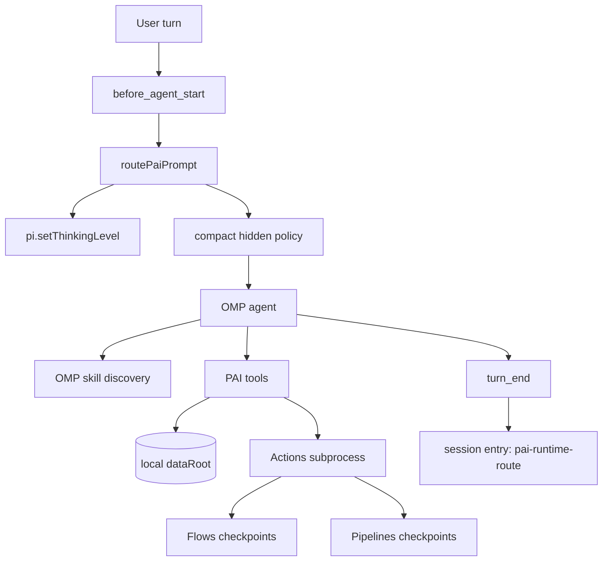

# omp-pai-system

Portable PAI runtime для Oh My Pi (OMP): нативная маршрутизация режимов мышления, локальные TELOS/MEMORY/PRD, безопасная автоматизация и перенос приватного состояния.

Текущая версия: `0.1.0`.

## Что делает пакет

- Загружается OMP как extension из `src/index.ts`.
- Классифицирует каждый пользовательский turn в `MINIMAL`, `NATIVE` или `ALGORITHM`.
- Выбирает нативный OMP thinking level через `pi.setThinkingLevel()` и добавляет короткую скрытую turn-policy.
- Предоставляет OMP-native skill `pai-deep-work`; обязательного чтения большого Algorithm-файла нет.
- Хранит TELOS, MEMORY, PRD и состояние автоматизации только в локальном `dataRoot`.
- Регистрирует типизированные OMP tools для retrieval, контролируемой записи и automation.
- Выполняет Actions в отдельных Bun-процессах с JSON Schema, timeout и лимитом вывода.
- Выполняет Flows и Pipelines с checkpoint, checksum и явным resume.
- Экспортирует и импортирует приватное состояние потоково, без перезаписи существующих файлов.
- Проверяет package, schema, permissions, ownership, automation definitions и private paths через `pai-doctor`.

HTTP-сервис и OpenAPI отсутствуют намеренно: публичный интерфейс — OMP Extension API, tools, hooks и slash commands.

## Архитектура


```mermaid
graph TD
  U[User turn] --> R[before_agent_start]
  R --> C[routePaiPrompt]
  C --> T[pi.setThinkingLevel]
  C --> P[compact hidden policy]
  P --> A[OMP agent]
  A --> S[OMP skill discovery]
  A --> X[PAI tools]
  X --> D[(local dataRoot)]
  X --> E[Actions subprocess]
  E --> F[Flows checkpoints]
  E --> L[Pipelines checkpoints]
  A --> Q[turn_end]
  Q --> J[session entry: pai-runtime-route]
```

### Поток одного turn

1. `createPaiPlugin()` один раз разрешает immutable config.
2. `before_agent_start` вызывает `routePaiPrompt()`.
3. `buildTurnPolicy()` формирует короткий policy с текущими путями TELOS/MEMORY/PRD и правилами выбранного режима.
4. `thinkingLevelForMode()` задаёт `minimal`, `low` или `high` через OMP API.
5. OMP выполняет turn обычными tools; сложная работа может явно вызвать skill `pai-deep-work`.
6. `turn_end` сохраняет компактную запись `pai-runtime-route` в session history.

Видимые mode headers, фиксированная строка `TASK`, TTS, голосовые side effects и обязательное чтение legacy Algorithm удалены.

## Режимы

| Режим | Thinking | Инструменты | Назначение |
|---|---|---:|---|
| `MINIMAL` | `minimal` | нет | приветствия, благодарности, простые подтверждения |
| `NATIVE` | `low` | да | короткие атомарные действия и вопросы |
| `ALGORITHM` | `high` | да | сложная, неоднозначная, исследовательская или многофайловая работа |

Контракт режимов находится в `contracts/runtime-gate.json`. Детерминированный `routePaiPrompt(prompt, isSubagent)` возвращает `{ mode, reason }`; delegated work по умолчанию получает `NATIVE`, чтобы не дублировать deep-work orchestration main agent, а явный `<pai-mode>ALGORITHM</pai-mode>` сохраняет приоритет.

## Установка

Требования:

- Bun `>=1.3.0`;
- `@oh-my-pi/pi-coding-agent >=16.4.8`.

Пакет объявляет extension в `package.json`:

```json
{
  "pi": {
    "extensions": ["./src/index.ts"]
  }
}
```

После установки:

```text
/pai-init
/pai-doctor
```

`pai-init` идемпотентен: создаёт только отсутствующие starter-файлы, не перезаписывает пользовательские данные и создаёт новые приватные paths с owner-only permissions (`0700` для каталогов, `0600` для файлов).

## Конфигурация

| Переменная | Назначение |
|---|---|
| `OMP_PAI_DATA_DIR` | Явный абсолютный или относительный локальный `dataRoot` |
| `PI_CODING_AGENT_DIR` | OMP profile root; по умолчанию `${PI_CODING_AGENT_DIR}/pai` |
| `HOME` / `USERPROFILE` | Fallback: `~/.omp/agent/pai` |

Network Algorithm overrides больше не являются частью runtime config.

## Локальное состояние

```text
<dataRoot>/
├── .omp-pai-ownership.json
├── TELOS/
│   ├── schema.json
│   └── BELIEFS.md ... PROJECTS.md
├── MEMORY/
│   ├── WORK/<slug>/PRD.md
│   ├── STATE/work.json
│   ├── STATE/flows/<flowId>.json
│   ├── STATE/pipelines/<pipelineId>.json
│   └── LEARNING/SYNTHESIS/{memories.jsonl,index.json}
└── PAI/
    ├── ACTIONS/<actionId>/{action.json,action.ts}
    ├── FLOWS/<flowId>.json
    └── PIPELINES/<pipelineId>.json
```

### TELOS

`src/state/telos.ts`:

- `parseTelosRecord()` проверяет frontmatter, тип записи, status, timestamp и body.
- `readTelosRecords()` безопасно читает все семь TELOS-файлов.
- `queryTelos()` ранжирует совпадения и возвращает текст со source path.
- `appendTelosEntry()` добавляет только явно переданный пользователем durable content и обновляет frontmatter.

### MEMORY

`src/state/memory.ts`:

- `parseMemoryRecord()` валидирует JSONL record.
- `readMemoryRecords()` читает записи с лимитами и проверяет уникальность UUID.
- `recordMemory()` требует provenance, confidence и `userConfirmed=true` для фактов/предпочтений.
- `rebuildMemoryIndex()` атомарно строит локальный индекс.
- `queryMemory()` выполняет bounded deterministic retrieval.

### PRD

`src/state/prd.ts`:

- `parsePrd()` проверяет восемь frontmatter fields и критерии `ISC-N`.
- `writePrd()`, `readPrd()` и `listPrds()` работают только внутри `MEMORY/WORK`.
- `syncPrdRegistry()` атомарно обновляет `MEMORY/STATE/work.json`.
- `registerPrdSyncHook()` синхронизирует registry после успешного OMP `write`/`edit` PRD-файла.

## OMP tools

| Tool | Approval | Поведение |
|---|---|---|
| `pai_context` | `read` | Bounded retrieval из TELOS/MEMORY с provenance |
| `pai_telos_append` | `write` | Добавляет валидированную TELOS entry |
| `pai_memory_record` | `write` | Записывает provenance-aware MEMORY record |
| `pai_prd` | `write` | `write`, `get`, `list` или `sync` PRD state |
| `pai_action_run` | `exec` | Запускает Action subprocess |
| `pai_flow_run` | `exec` | Запускает или явно возобновляет Flow |
| `pai_pipeline_run` | `exec` | Запускает или явно возобновляет Pipeline |

Tools регистрируются в `src/tools/pai-tools.ts`; параметры валидируются OMP Zod schemas до вызова runtime.

## Actions

Action хранится в `PAI/ACTIONS/<id>` и состоит из `action.json` и одного `.js`/`.ts` entry-файла. Формальный контракт: `contracts/action.schema.json`.

Runtime:

1. Проверяет id, manifest fields и basename-only entry.
2. Проверяет input по manifest JSON Schema.
3. Запрещает symlink entry.
4. Запускает `Bun.spawn([process.execPath, entry])` в каталоге Action.
5. Передаёт input как JSON в stdin; оставляет в env только `PATH` и `OMP_PAI_ACTION_ID`.
6. Ограничивает timeout `1..300000 ms`, stdout/stderr — `1 MiB`; OMP `AbortSignal` завершает process tree и возвращает явную ошибку cancellation.
7. Требует exit code `0`, один JSON result и валидный output schema.
8. Возвращает output, duration и SHA-256 manifest+entry.

Секреты не хранятся в manifest и не наследуются из полного host env.

## Flows

Flow — детерминированная state machine из `PAI/FLOWS/<id>.json`. Формальный контракт: `contracts/flow.schema.json`.

Каждое состояние запускает Action. После успеха оно либо переходит в `onSuccess`, либо завершает flow (`terminal: true`), либо сохраняет `paused` checkpoint (`pause: true`). Ошибка Action сохраняет `failed` на текущем state и не создаёт скрытого перехода/retry; отмена OMP также сохраняет failure checkpoint, затем пробрасывается как cancellation.

Checkpoint хранит definition SHA-256, current state, input/output, status и timestamp. Resume разрешён только явно и только при совпадающем definition checksum.

## Pipelines

Pipeline — последовательность Actions из `PAI/PIPELINES/<id>.json`. Формальный контракт: `contracts/pipeline.schema.json`.

`input` шага может содержать ссылки:

- `$pipeline.input` или `$pipeline.input.<path>`;
- `$steps.<previous-step>.output` или `$steps.<previous-step>.output.<path>`.

Forward references запрещены. После каждого шага runtime сохраняет output, output SHA-256, exact Action id и Action SHA-256. Resume принимает только строгий prefix проверенных completed steps; изменение definition, initial input, completed output, Action id или выполненного Action блокирует продолжение. OMP cancellation завершает текущий Action, сохраняет failed checkpoint и пробрасывается вызывающему tool runtime.

## Slash commands

| Command | Назначение |
|---|---|
| `/pai-init` | Инициализировать локальное состояние без перезаписи |
| `/pai-doctor` | Read-only диагностика package/state/schema/permissions |
| `/pai-memory-reindex` | Перестроить MEMORY index |
| `/pai-prd-sync` | Проверить PRD и синхронизировать work registry |
| `/pai-private-export <path>` | Потоково экспортировать TELOS/MEMORY в `tar.gz` |
| `/pai-private-import <path>` | Потоково импортировать архив без перезаписи |

Private archive содержит `manifest.json` с SHA-256 и metadata. Import запрещает path traversal, symlinks/hardlinks/devices, дубликаты, conflicts и archive внутри canonical `dataRoot`; лимитирует compressed snapshot и весь expanded tar stream до записи. Commit/rollback привязаны к inode identity и не удаляют concurrent replacements. Export отклоняет symlink ancestors и hardlinked sources. Все state directories обязаны быть owner-only `0700`, файлы создаются с mode `0600`.

## Doctor

`runPaiDoctor()` ничего не изменяет. Он проверяет:

- package metadata и OMP-native skill;
- completeness PAI templates;
- отсутствие symlink в state roots;
- owner-only permissions всего дерева `dataRoot`;
- ownership manifest;
- TELOS schema и records;
- MEMORY layout, records, PRD и work registry;
- Action/Flow/Pipeline definitions;
- private path/file safety.

## Разработка и release gates

```bash
bun run typecheck
bun test
bun run build:staging
bun run audit:privacy
bun run release:pack
bun run test:lifecycle
bun run smoke:install
```

Release staging строится только из allowlist. Privacy audit проверяет sensitive patterns и provenance. Release pack повторно извлекается и сканируется; lifecycle smoke выполняет реальный OMP install/list/doctor/upgrade/uninstall в изолированном profile.

## Документация

- [Best practices и security model](docs/best-practices.md)
- [FAQ](docs/faq.md)
- [Extension SDK](docs/sdk.md)
- [История изменений](CHANGELOG.md)

Исходный код — Apache-2.0. Provenance и third-party notices: `privacy/provenance-manifest.json`, `THIRD_PARTY_NOTICES.md`.
