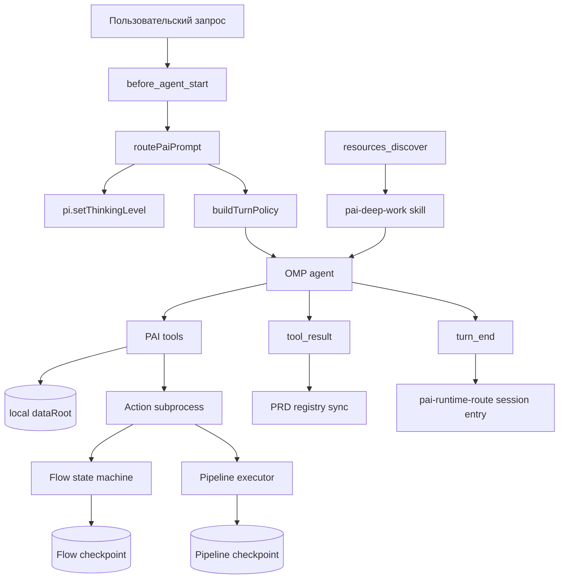

# omp-pai-system

> [!WARNING]
> **Проект устарел с 2026-09-24 и больше не развивается.**
>
> В харнесе OMP обвязка PAI (режимы MINIMAL / NATIVE / ALGORITHM LIGHT / ALGORITHM, заголовки, `TASK` из восьми слов, runtime gate) полностью снята. Вместо неё работает **Algorithm 4.1-omp** — скилл и extension в [I1eanch/skills](https://github.com/I1eanch/skills/tree/main/algorithm):
>
> - `algorithm/SKILL.md` — метод: дословная цель, проверяемые критерии с доказательствами, независимая проверка, Ask Check;
> - `algorithm/extension/algorithm-guard.ts` — детерминированные проверки PRD и подсказки после разрушающих операций;
> - `algorithm/isa-check.ts` и `ISA-FORMAT.md` — живой ISA проекта с автоматическими проверками и кешем.
>
> Что осталось в этом репозитории:
>
> - `main` — версия с Actions, Flows и Pipelines (август 2026); в харнес она не устанавливалась.
> - ветка [`archive/final-runtime-20260924`](https://github.com/I1eanch/omp-pai-system/tree/archive/final-runtime-20260924) — состояние runtime gate, которое фактически работало в OMP до перехода (набор тестов на момент архивации: 38 pass / 6 fail — устаревшие ожидания holdout-тестов).
>
> Описание ниже сохранено как историческое.

`omp-pai-system` — локальный runtime для Personal AI Infrastructure (PAI) внутри [Oh My Pi (OMP)](https://github.com/can1357/oh-my-pi). Пакет подключается как OMP extension, выбирает подходящий режим мышления для каждого запроса, предоставляет структурированную долговременную память и запускает контролируемые локальные автоматизации.

Текущая версия: `0.1.0`.

Проект не является HTTP-сервисом. Он не открывает порт, не предоставляет REST API и не требует OpenAPI. Публичная поверхность проекта — OMP Extension API, lifecycle hooks, tools, slash commands и source-level TypeScript API.

## Содержание

- [Для чего нужен проект](#для-чего-нужен-проект)
- [Основные возможности](#основные-возможности)
- [Что проект намеренно не делает](#что-проект-намеренно-не-делает)
- [Архитектура](#архитектура)
- [Как обрабатывается один запрос](#как-обрабатывается-один-запрос)
- [Режимы MINIMAL, NATIVE и ALGORITHM](#режимы-minimal-native-и-algorithm)
- [Установка и первый запуск](#установка-и-первый-запуск)
- [Конфигурация](#конфигурация)
- [Структура локального состояния](#структура-локального-состояния)
- [TELOS](#telos)
- [MEMORY](#memory)
- [PRD и реестр работы](#prd-и-реестр-работы)
- [OMP tools](#omp-tools)
- [Slash commands](#slash-commands)
- [Actions](#actions)
- [Flows](#flows)
- [Pipelines](#pipelines)
- [Private export/import](#private-exportimport)
- [Doctor](#doctor)
- [Безопасная работа с файлами](#безопасная-работа-с-файлами)
- [TypeScript API и функции](#typescript-api-и-функции)
- [Структура исходного проекта](#структура-исходного-проекта)
- [Ошибки, отмена и восстановление](#ошибки-отмена-и-восстановление)
- [Security model](#security-model)
- [Разработка, тестирование и release](#разработка-тестирование-и-release)

## Для чего нужен проект

Обычный OMP-агент хорошо выполняет отдельные задачи, но без дополнительного runtime ему приходится каждый раз заново решать несколько инфраструктурных вопросов:

1. насколько глубокое рассуждение требуется для текущего запроса;
2. какой персональный контекст действительно нужен именно сейчас;
3. где безопасно хранить долговременные цели, решения и рабочие записи;
4. как выполнять повторяемые локальные операции с проверяемыми входами и выходами;
5. как продолжить Flow или Pipeline после паузы, ошибки либо перезапуска;
6. как переносить приватное состояние между OMP profiles без случайной публикации или перезаписи.

`omp-pai-system` решает эти задачи как локальный слой между OMP lifecycle и пользовательским state:

- простые сообщения не получают лишнюю orchestration-нагрузку;
- сложные запросы получают повышенный native thinking level и focused skill;
- TELOS и MEMORY загружаются только по запросу, а не добавляются целиком в каждый prompt;
- долговременная запись выполняется только через валидируемые операции;
- автоматизация строится из декларативных Action, Flow и Pipeline contracts;
- приватные данные остаются вне устанавливаемого package и release archive.

Типовые сценарии:

- сохранить подтверждённую пользователем цель, решение или предпочтение;
- найти релевантный контекст без чтения всей персональной базы;
- вести проверяемый PRD для работы, которая должна пережить несколько сессий;
- запускать локальную JSON-in/JSON-out операцию в отдельном процессе;
- собрать последовательность операций с checkpoint и строгим resume;
- экспортировать только TELOS/MEMORY в checksummed `tar.gz`;
- проверить целостность установки командой `/pai-doctor`.

## Основные возможности

- OMP-native extension entrypoint в `src/index.ts`.
- Детерминированная маршрутизация каждого turn в `MINIMAL`, `NATIVE` или `ALGORITHM`.
- Выбор thinking level через официальный `pi.setThinkingLevel()`.
- Короткая скрытая turn-policy вместо видимых protocol headers.
- Native skill discovery для `skills/pai-deep-work/SKILL.md`.
- Локальные TELOS, MEMORY и persistent PRD.
- Семь typed OMP tools с approval tiers `read`, `write` и `exec`.
- Шесть slash commands для lifecycle, диагностики, индекса и private state.
- Actions в отдельных Bun subprocess с JSON Schema, timeout, bounded streams и cancellation.
- Flows как проверяемые state machines.
- Pipelines как checksum-bound последовательности Actions.
- Streaming private export/import без перезаписи существующих файлов.
- Owner-only directories/files и descriptor-based filesystem operations.
- Allowlisted release staging, privacy/provenance audit и archive rescan.

## Что проект намеренно не делает

- Не поднимает HTTP, WebSocket, voice или TTS server.
- Не вызывает TTS, голосовые hooks, notification, analytics или telemetry services.
- Не отправляет TELOS/MEMORY во внешние сервисы самостоятельно.
- Не хранит API keys в Action manifests.
- Не наследует полный host environment в Action subprocess.
- Не загружает всю персональную память в каждый prompt.
- Не заставляет агента печатать mode banners, `TASK:` или скрытые рассуждения.
- Не требует обязательного чтения legacy Algorithm-файла.
- Не создаёт PRD для каждой короткой задачи: для обычного прогресса используется native OMP todo/goal state.
- Не выполняет скрытые retries в Flow/Pipeline.
- Не удаляет пользовательские TELOS/MEMORY при uninstall package.

## Архитектура


```mermaid
graph TD
  U[Пользовательский запрос] --> BAS[before_agent_start]
  BAS --> R[routePaiPrompt]
  R --> TL[pi.setThinkingLevel]
  R --> HP[buildTurnPolicy]
  HP --> AG[OMP agent]
  RD[resources_discover] --> SK[pai-deep-work skill]
  SK --> AG
  AG --> TOOLS[PAI tools]
  TOOLS --> STATE[(local dataRoot)]
  TOOLS --> ACT[Action subprocess]
  ACT --> FLOW[Flow state machine]
  ACT --> PIPE[Pipeline executor]
  FLOW --> CP1[(Flow checkpoint)]
  PIPE --> CP2[(Pipeline checkpoint)]
  AG --> TR[tool_result]
  TR --> PRD[PRD registry sync]
  AG --> TE[turn_end]
  TE --> SE[pai-runtime-route session entry]
```

### Основные слои

| Слой | Файлы | Ответственность |
|---|---|---|
| Entrypoint | `src/index.ts` | Собирает config, runtime, tools и commands в один OMP extension |
| Runtime routing | `src/runtime/*` | Классифицирует turn, выбирает thinking, добавляет hidden policy, публикует skill path |
| State | `src/state/*` | TELOS, MEMORY, PRD, frontmatter и безопасные файловые операции |
| Automation | `src/automation/*` | Action execution, Flow state machine, Pipeline executor, JSON Schema subset |
| OMP surface | `src/tools/pai-tools.ts` | Typed tools и две state-maintenance команды |
| Lifecycle commands | `src/commands/*` | Init, doctor, private export и private import |
| Private bundle | `src/private-bundle.ts` | Path validation, enumeration, SHA-256 и inode-bound commit helpers |
| Contracts | `contracts/*` | Machine-readable runtime, Action, Flow, Pipeline и MEMORY schemas |
| Templates | `templates/*` | Starter TELOS/MEMORY и форматы пользовательских automation definitions |
| Release | `scripts/*`, `privacy/*` | Allowlist, privacy/provenance gates, package assembly и lifecycle smoke |

### OMP hooks

Extension регистрирует четыре hook-направления:

| Hook | Где регистрируется | Что делает |
|---|---|---|
| `resources_discover` | `createPaiRuntime()` | Возвращает `skillPaths` с каталогом native PAI skills |
| `before_agent_start` | `createPaiRuntime()` | Определяет mode, меняет thinking level и дополняет system prompt скрытой policy |
| `turn_end` | `createPaiRuntime()` | Записывает mode/reason текущего turn через `pi.appendEntry()` |
| `tool_result` | `registerPrdSyncHook()` | После успешного OMP `write`/`edit` внутри `MEMORY/WORK` перестраивает PRD registry |

## Как обрабатывается один запрос

### 1. Загрузка extension

OMP обнаруживает `src/index.ts` через поле `pi.extensions` в `package.json`. Default export уже создан вызовом `createPaiPlugin({ pluginRoot })`.

Во время создания plugin:

1. `resolvePaiConfig()` нормализует `pluginRoot` и вычисляет `dataRoot`.
2. `createPaiRuntime()` получает пути к state и skills.
3. Возвращаемая функция регистрирует runtime hooks.
4. `registerPrdSyncHook()` подключает синхронизацию persistent PRD.
5. `registerPaiTools()` регистрирует typed tools и maintenance commands.
6. `createPaiPlugin()` регистрирует `/pai-init`, `/pai-doctor`, `/pai-private-export` и `/pai-private-import`.

### 2. Discovery ресурсов

На `resources_discover` runtime возвращает путь `skills/`. OMP видит `pai-deep-work` как обычный native skill и может загрузить его только для сложной работы.

### 3. Начало turn

На `before_agent_start`:

1. `isSubagentSystemPrompt()` определяет delegated agent по официальному или legacy marker.
2. `routePaiPrompt()` возвращает `{ mode, reason }`.
3. `thinkingLevelForMode()` переводит PAI mode в OMP thinking level.
4. Runtime вызывает `pi.setThinkingLevel()`; ошибка применения thinking логируется как warning и не ломает turn.
5. `buildTurnPolicy()` создаёт короткий hidden policy с абсолютными путями к TELOS, MEMORY и PAI definitions.
6. Policy добавляется к существующему `systemPrompt`, не заменяя host instructions.

Policy требует завершить запрос end-to-end, проверять изменения, загружать персональный контекст только по необходимости и не обращаться к voice/TTS/telemetry services.

### 4. Выполнение

Агент использует обычные OMP tools. При необходимости он вызывает PAI tools:

- читает focused context;
- добавляет подтверждённую долговременную запись;
- создаёт или читает persistent PRD;
- запускает Action, Flow или Pipeline.

Tool inputs сначала проверяются OMP Zod schema, затем доменными runtime validators.

### 5. Завершение turn

На `turn_end` runtime добавляет session entry:

```json
{
  "schemaVersion": 1,
  "turnIndex": 12,
  "mode": "algorithm",
  "reason": "complex-task"
}
```

Entry имеет type `pai-runtime-route`. Она сохраняет диагностируемую историю routing, но не содержит prompt, TELOS, MEMORY или hidden reasoning.

## Режимы MINIMAL, NATIVE и ALGORITHM

Контракт находится одновременно в коде `src/runtime/pai-runtime-contract.ts` и machine-readable файле `contracts/runtime-gate.json`.

| Mode | OMP thinking | Tools expected | Назначение |
|---|---|---:|---|
| `MINIMAL` | `minimal` | нет | Приветствия, благодарности, оценки, простые подтверждения |
| `NATIVE` | `low` | да | Короткие атомарные действия и однозначные вопросы |
| `ALGORITHM` | `high` | да | Реализация, debugging, investigation, design, refactoring, planning и multi-file work |

### Приоритет classifier

`routePaiPrompt(prompt, isSubagent)` применяет правила строго по порядку:

1. Явный `<pai-mode>ALGORITHM</pai-mode>` всегда выбирает `ALGORITHM`.
2. Delegated/subagent work по умолчанию получает `NATIVE`, чтобы не дублировать orchestration main agent.
3. Короткое сообщение из minimal vocabulary получает `MINIMAL`.
4. Явные признаки сложной задачи получают `ALGORITHM`.
5. Один короткий action/question до 16 слов без нескольких действий получает `NATIVE`.
6. Любой неоднозначный main-agent prompt fail-safe маршрутизируется в `ALGORITHM`.

Возможные `reason`:

- `explicit-algorithm`;
- `subagent-default`;
- `minimal-message`;
- `complex-task`;
- `short-atomic-task`;
- `safe-fallback`.

Mode остаётся внутренним. Runtime не требует печатать header, mode name или фиксированную строку `TASK:` в ответе.

## Установка и первый запуск

### Требования

- Linux, macOS или Windows с Bun `>=1.3.0`;
- OMP / `@oh-my-pi/pi-coding-agent >=16.4.8`;
- локальная filesystem с поддержкой обычных файлов и каталогов;
- для строгих owner/mode checks рекомендуется POSIX filesystem.

Package metadata:

```json
{
  "name": "omp-pai-system",
  "pi": {
    "extensions": ["./src/index.ts"]
  }
}
```

### Установка из checkout

```bash
omp plugin install /absolute/path/to/omp-pai-system --json
```

Проверить, что package обнаружен:

```bash
omp plugin list --json
omp plugin doctor omp-pai-system --json
```

После запуска OMP выполните slash commands:

```text
/pai-init
/pai-doctor
```

`/pai-init` идемпотентен. Он:

- создаёт отсутствующие каталоги;
- копирует только отсутствующие starter-файлы;
- никогда не перезаписывает существующий пользовательский файл;
- записывает `.omp-pai-ownership.json` только для package-owned starter artifacts;
- использует `0700` для state directories и `0600` для создаваемых state files.

### Обновление

```bash
omp plugin install /absolute/path/to/omp-pai-system --force --json
```

Force reinstall обновляет package, но не должен перезаписывать state в отдельном `dataRoot`.

### Удаление

```bash
omp plugin uninstall omp-pai-system --json
```

Uninstall удаляет регистрацию/package, но пользовательский `dataRoot` остаётся отдельным локальным состоянием.

## Конфигурация

`resolvePaiConfig()` вычисляет пути один раз при создании plugin.

| Переменная | Приоритет | Поведение |
|---|---:|---|
| `OMP_PAI_DATA_DIR` | 1 | Явный local data root; нормализуется через `resolve()` |
| `PI_CODING_AGENT_DIR` | 2 | Используется `<PI_CODING_AGENT_DIR>/pai` |
| `HOME` / `USERPROFILE` | 3 | Fallback `~/.omp/agent/pai` |

`pluginRoot` также нормализуется через `resolve()` и указывает на immutable package catalog. Если невозможно определить profile/data root, загрузка fail-closed завершается ошибкой `Cannot resolve OMP profile directory`.

Пример embedded integration:

```ts
import { createPaiPlugin } from "omp-pai-system/src/index.ts";

export default createPaiPlugin({
  pluginRoot: "/opt/omp/plugins/omp-pai-system",
  env: {
    OMP_PAI_DATA_DIR: "/srv/private/omp-pai"
  }
});
```

Network Algorithm overrides не поддерживаются. Runtime не загружает prompt или Algorithm по URL.

## Структура локального состояния

После `/pai-init` и первых операций дерево имеет следующий вид:

```text
<dataRoot>/
├── .omp-pai-ownership.json
├── TELOS/
│   ├── README.md
│   ├── schema.json
│   ├── BELIEFS.md
│   ├── CHALLENGES.md
│   ├── DECISIONS.md
│   ├── GOALS.md
│   ├── IDEAS.md
│   ├── LEARNED.md
│   └── PROJECTS.md
├── MEMORY/
│   ├── README.md
│   ├── layout.json
│   ├── WORK/
│   │   └── <slug>/PRD.md
│   ├── STATE/
│   │   ├── work.json
│   │   ├── work.schema.json
│   │   ├── memory-index.json
│   │   ├── flows/<flowId>.json
│   │   └── pipelines/<pipelineId>.json
│   ├── LEARNING/
│   │   ├── README.md
│   │   ├── REFLECTIONS/algorithm-reflections.jsonl
│   │   ├── SIGNALS/ratings.jsonl
│   │   ├── FAILURES/
│   │   └── SYNTHESIS/memories.jsonl
│   └── RAW/
└── PAI/
    ├── ACTIONS/<actionId>/
    │   ├── action.json
    │   └── <entry>.ts
    ├── FLOWS/<flowId>.json
    └── PIPELINES/<pipelineId>.json
```

Разделение важно:

- `pluginRoot` — устанавливаемый, distributable и считающийся immutable package;
- `dataRoot` — mutable локальное состояние конкретного OMP profile;
- `TELOS` и `MEMORY` — приватный контекст;
- `PAI` — локальные executable/declarative automation definitions;
- `MEMORY/STATE` — derived indexes и resumable checkpoints.

## TELOS

TELOS хранит долгоживущую направленность пользователя: убеждения, вызовы, решения, цели, идеи, извлечённые уроки и проекты.

Поддерживаемые `recordType`:

- `beliefs`;
- `challenges`;
- `decisions`;
- `goals`;
- `ideas`;
- `learned`;
- `projects`.

Каждый тип привязан к одному canonical Markdown-файлу. Пример `TELOS/GOALS.md`:

```markdown
---
schema_version: 1
record_type: goals
status: active
updated: 2026-08-06T12:00:00.000Z
---

## Entries

### 2026-08-06T12:00:00.000Z

Оптимизировать OMP workflow без внешней телеметрии.
```

### Инварианты TELOS

- Frontmatter содержит ровно `schema_version`, `record_type`, `status`, `updated`.
- `schema_version` равен `1`.
- `status`: `starter`, `active` или `archived`.
- `updated`: ISO-compatible timestamp либо `null`.
- Body обязательно содержит `## Entries`.
- Тип frontmatter обязан соответствовать filename.
- Archived records не участвуют в retrieval.
- Одна append entry ограничена 32 KiB и не может содержать NUL.

### Как работает retrieval

`queryTelos()`:

1. выделяет уникальные Unicode letter/number terms длиной от двух символов;
2. разбивает содержимое после `## Entries` на Markdown blocks;
3. считает число query terms, найденных в каждом block;
4. исключает score `0` и archived records;
5. сортирует по score, затем по source path;
6. обрезает каждый возвращаемый block до 4000 символов и общий результат до `limit`.

`limit` runtime API: `1..100`, default `8`. Tool `pai_context` ограничивает его диапазоном `1..50`.

### Основные функции TELOS

- `parseTelosRecord()` — strict frontmatter/body validation.
- `readTelosRecords()` — безопасное чтение canonical TELOS files.
- `queryTelos()` — deterministic focused retrieval с source path.
- `appendTelosEntry()` — owner-only atomic append, переводящий record в `active`.

## MEMORY

MEMORY хранит атомарные provenance-bearing записи, которые удобнее искать и валидировать как JSONL, а не как большие Markdown-документы.

Поддерживаемые kinds:

- `fact` — подтверждённый персональный факт;
- `preference` — подтверждённое предпочтение;
- `decision` — принятое решение;
- `lesson` — извлечённый урок;
- `note` — нейтральная заметка.

Canonical source: `MEMORY/LEARNING/SYNTHESIS/memories.jsonl`. Одна строка — один record:

```json
{"schemaVersion":1,"id":"9b2dc751-8797-46dc-8c1e-cbd4b6b30ac9","kind":"preference","content":"Предпочитать native OMP API","source":"explicit user statement","confidence":1,"userConfirmed":true,"createdAt":"2026-08-06T12:00:00.000Z"}
```

### Инварианты MEMORY

- Ровно восемь полей; unknown fields отклоняются.
- `id` — UUID и уникален во всём JSONL.
- `kind` входит в разрешённый enum.
- `content` непустой, без NUL, до 32 KiB.
- `source` непустой, без NUL, до 1024 bytes.
- `confidence` — finite number от `0` до `1`.
- `userConfirmed` всегда boolean.
- `fact` и `preference` требуют `userConfirmed: true`.
- `createdAt` — parseable timestamp.
- Весь canonical JSONL ограничен 64 MiB при чтении.

### Запись и индекс

`recordMemory()` сначала перечитывает и проверяет canonical JSONL, отклоняет duplicate UUID, затем:

1. открывает `memories.jsonl` с `O_APPEND | O_CREAT | O_WRONLY | O_NOFOLLOW`;
2. принудительно задаёт mode `0600`;
3. append-ит ровно одну JSONL line;
4. выполняет `fsync`;
5. перестраивает `MEMORY/STATE/memory-index.json` атомарной записью.

Index — derived artifact с `id`, `kind`, `createdAt` и нормализованными terms. Источником истины остаётся `memories.jsonl`. Текущий `queryMemory()` выполняет bounded scan canonical records, а не доверяет потенциально устаревшему index.

### Как считается MEMORY score

Для каждой записи:

```text
termScore = число уникальных query terms, найденных в content
score = termScore × confidence
```

Пустой query даёт базовый `termScore = 1`. Результаты сортируются по score, затем по `createdAt` от новых к старым. Runtime limit: `1..100`, default `8`.

### Основные функции MEMORY

- `parseMemoryRecord()` — проверяет один persisted record.
- `readMemoryRecords()` — bounded JSONL read и duplicate detection.
- `recordMemory()` — privacy-aware durable append и index refresh.
- `rebuildMemoryIndex()` — полная deterministic rebuild derived index.
- `queryMemory()` — deterministic retrieval с confidence weighting.

## PRD и реестр работы

PRD нужен только для работы, состояние которой должно переживать session boundary. Короткие задачи должны использовать native OMP todo/goal.

Canonical path:

```text
MEMORY/WORK/<slug>/PRD.md
```

Пример:

```markdown
---
task: Реализовать безопасный импорт
slug: 20260806-120000_safe-import
effort: standard
phase: verify
progress: 2/3
mode: interactive
started: 2026-08-06T10:00:00.000Z
updated: 2026-08-06T12:00:00.000Z
---

## Context

Импорт не должен перезаписывать существующий state.

## Criteria

- [x] ISC-1: Архив проверяется до commit.
- [x] ISC-2: Existing destination блокирует import.
- [ ] ISC-3: Lifecycle smoke проходит.

## Decisions

Использовать no-overwrite hard-link commit.

## Verification

`bun test tests/state/private-roundtrip.test.ts`
```

### PRD contract

Обязательные поля:

- `task`;
- `slug`;
- `effort`;
- `phase`;
- `progress`;
- `mode`;
- `started`;
- `updated`.

Опционально разрешён только `iteration`. Phase принимает:

```text
observe -> think -> plan -> build -> execute -> verify -> learn -> complete
```

Каждый criterion имеет форму:

```markdown
- [ ] ISC-N: Проверяемое условие
```

`progress` обязан точно совпадать с количеством checked/total criteria. Duplicate criterion ids, unknown frontmatter fields, invalid timestamps и несоответствие directory slug блокируют чтение.

### Registry

`syncPrdRegistry()` строит `MEMORY/STATE/work.json`:

```json
{
  "schemaVersion": 1,
  "sessions": {
    "20260806-120000_safe-import": {
      "prd": "MEMORY/WORK/20260806-120000_safe-import/PRD.md",
      "phase": "verify",
      "progress": "2/3",
      "updated": "2026-08-06T12:00:00.000Z"
    }
  }
}
```

Registry перестраивается:

- после `writePrd()`;
- через `pai_prd { operation: "sync" }`;
- командой `/pai-prd-sync`;
- автоматически после успешного OMP `write`/`edit`, затронувшего `MEMORY/WORK`.

### Основные функции PRD

- `parsePrd()` — validation frontmatter, criteria и progress.
- `readPrd()` — безопасное чтение по slug.
- `listPrds()` — canonical listing с сортировкой по `updated`.
- `writePrd()` — atomic write и registry sync.
- `syncPrdRegistry()` — rebuild `work.json`.
- `registerPrdSyncHook()` — OMP `tool_result` integration.

## OMP tools

Все tools регистрируются в `src/tools/pai-tools.ts`. Каждый успешный tool result содержит:

- `content`: один text block с pretty-printed JSON;
- `details`: тот же результат как structured object.

### Полная таблица tools

| Tool | Approval | Parameters | Результат |
|---|---|---|---|
| `pai_context` | `read` | `query`, optional `sources`, optional `limit` | `{ telos, memory }` с source/provenance |
| `pai_telos_append` | `write` | `recordType`, `text` | Metadata обновлённого TELOS record |
| `pai_memory_record` | `write` | `kind`, `content`, `source`, `confidence`, `userConfirmed` | Полный MEMORY record |
| `pai_prd` | `write` | `operation`, optional `slug`, optional `content` | PRD, список или sync report |
| `pai_action_run` | `exec` | `actionId`, `input` | `ActionExecutionReport` |
| `pai_flow_run` | `exec` | `flowId`, `input`, optional `resume`, optional `maxSteps` | `FlowRunReport` |
| `pai_pipeline_run` | `exec` | `pipelineId`, `input`, optional `resume` | `PipelineRunReport` |

### `pai_context`

```json
{
  "query": "OMP automation",
  "sources": ["telos", "memory"],
  "limit": 8
}
```

- `sources` default: обе системы;
- разрешённые sources: `telos`, `memory`;
- `limit`: `1..50`, default `8`;
- операция read-only.

### `pai_telos_append`

```json
{
  "recordType": "decisions",
  "text": "Использовать native OMP hooks вместо provider-specific payload."
}
```

Text ограничивается tool schema и повторно проверяется runtime. Запись изменяет только соответствующий TELOS file.

### `pai_memory_record`

```json
{
  "kind": "lesson",
  "content": "Checkpoint должен быть привязан к definition digest.",
  "source": "verified implementation result",
  "confidence": 0.95,
  "userConfirmed": false
}
```

Для `fact` и `preference` `userConfirmed` обязан быть `true`.

### `pai_prd`

Поддерживаемые operations:

- `write` — требует `content`;
- `get` — требует `slug`;
- `list` — возвращает metadata без полного Markdown content;
- `sync` — перестраивает registry.

### Automation tools и cancellation

`pai_action_run`, `pai_flow_run` и `pai_pipeline_run` получают OMP `AbortSignal` третьим аргументом tool handler и передают тот же signal до активного Action process. Отдельный polling adapter не используется.

## Slash commands

| Command | Что делает | Мутация |
|---|---|---:|
| `/pai-init` | Создаёт отсутствующие starter paths и ownership manifest | да, no-overwrite |
| `/pai-doctor` | Проверяет package, state, schemas, permissions и safety | нет |
| `/pai-memory-reindex` | Перестраивает `MEMORY/STATE/memory-index.json` | да |
| `/pai-prd-sync` | Валидирует PRD и перестраивает `work.json` | да |
| `/pai-private-export <path>` | Создаёт checksummed private `tar.gz` | только archive path |
| `/pai-private-import <path>` | Импортирует отсутствующие TELOS/MEMORY files | да, no-overwrite |

Path argument export/import может быть без кавычек либо заключён в одинарные/двойные кавычки. Пустой argument возвращает usage error.

## Actions

Action — одна trusted local JSON-in/JSON-out операция.

### Layout

```text
<dataRoot>/PAI/ACTIONS/normalize-title/
├── action.json
└── action.ts
```

`actionId` соответствует `^[a-z0-9][a-z0-9-]{0,63}$`.

### Manifest

```json
{
  "schemaVersion": 1,
  "id": "normalize-title",
  "entry": "action.ts",
  "description": "Normalize a title",
  "input": {
    "type": "object",
    "required": ["title"],
    "additionalProperties": false,
    "properties": {
      "title": { "type": "string", "minLength": 1 }
    }
  },
  "output": {
    "type": "object",
    "required": ["title"],
    "additionalProperties": false,
    "properties": {
      "title": { "type": "string" }
    }
  },
  "timeoutMs": 5000
}
```

Формальная schema: `contracts/action.schema.json`.

Manifest:

- ограничен 1 MiB;
- содержит ровно `schemaVersion`, `id`, `entry`, `description`, `input`, `output`, `timeoutMs`;
- обязан совпадать id с directory;
- использует basename-only `.js`/`.ts` entry;
- запрещает absolute path, `..`, backslash, NUL и symlink entry;
- ограничивает timeout диапазоном `1..300000 ms`.

### Поддерживаемый JSON Schema subset

Runtime fail-closed поддерживает:

- `type`;
- `const`;
- `enum`;
- `minLength`, `maxLength`, `pattern`;
- `minimum`, `maximum`;
- `minItems`, `maxItems`, `items`;
- `properties`, `required`, `additionalProperties`.

Типы: `array`, `boolean`, `integer`, `null`, `number`, `object`, `string`. Boolean schemas `true`/`false` поддерживаются. Неизвестные keywords, противоречивые bounds, invalid regex и malformed keyword values отклоняются до запуска process.

### Process contract

Action entry читает JSON из stdin и печатает один JSON result в stdout:

```ts
const input = await new Response(Bun.stdin.stream()).json() as { title: string };
const output = { title: input.title.trim().toLocaleLowerCase() };
console.log(JSON.stringify(output));
```

Runtime выполняет следующий pipeline:

1. Проверяет `AbortSignal` до старта.
2. Валидирует input как finite recursive JSON value.
3. Загружает и валидирует manifest.
4. Валидирует input по manifest schema.
5. Проверяет regular non-symlink entry.
6. Хеширует exact bytes manifest+entry до spawn.
7. Запускает `Bun.spawn([process.execPath, entryPath])` в Action directory.
8. Передаёт только `PATH` и `OMP_PAI_ACTION_ID` в environment.
9. Записывает input JSON line в stdin.
10. Параллельно читает stdout, stderr и exit status.
11. Ограничивает stdout и stderr по 1 MiB каждый.
12. По timeout/cancellation завершает process group, затем direct child fallback.
13. Требует exit code `0`.
14. Парсит stdout как JSON и валидирует output schema.
15. Возвращает `actionId`, `output`, `definitionSha256`, `durationMs`.

`definitionSha256` связывает checkpoints с exact manifest и executable entry. Изменение любого из них делает сохранённый Flow/Pipeline checkpoint несовместимым.

## Flows

Flow — детерминированная state machine, где каждый state запускает один Action.

### Definition

`PAI/FLOWS/review.json`:

```json
{
  "schemaVersion": 1,
  "id": "review",
  "initial": "classify",
  "states": {
    "classify": {
      "action": "classify-item",
      "onSuccess": "confirm",
      "pause": true
    },
    "confirm": {
      "action": "confirm-item",
      "onSuccess": "store"
    },
    "store": {
      "action": "store-item",
      "terminal": true
    }
  }
}
```

Формальная schema: `contracts/flow.schema.json`.

### Graph invariants

- `flowId`, state name и Action id используют safe id pattern.
- Definition `id` совпадает с filename.
- `initial` указывает на существующий state.
- Каждый non-terminal state имеет `onSuccess`.
- Каждый `onSuccess` указывает на существующий state.
- Terminal state не имеет `onSuccess` и не может иметь `pause: true`.
- Unknown fields отклоняются.
- Definition ограничен 2 MiB.
- `maxSteps`: `1..10000`, default `100`.

### Выполнение

1. Runtime загружает definition и вычисляет SHA-256 exact JSON bytes.
2. Без `resume: true` создаётся новый checkpoint на `initial`.
3. Action получает `lastInput`.
4. После success runtime сохраняет Action id и Action SHA-256 в `completed[current]`.
5. Terminal state сохраняет `completed` и возвращает final output.
6. Non-terminal state передаёт Action output как `lastInput` следующего state.
7. `pause: true` сначала сохраняет следующий state и output, затем возвращает status `paused`.
8. Ошибка сохраняет status `failed`, текущий state и message.
9. Step limit также сохраняет `failed`.

Checkpoint:

```text
MEMORY/STATE/flows/<flowId>.json
```

Он содержит definition SHA-256, `current`, status, `initialInput`, `lastInput`, optional `lastOutput`, completed Action digests, error и timestamp.

### Resume

Resume выполняется только с `resume: true`:

```json
{
  "flowId": "review",
  "input": {},
  "resume": true
}
```

При resume runtime:

- проверяет checkpoint shape;
- сравнивает definition SHA-256;
- проверяет Action id каждого completed state;
- повторно вычисляет SHA-256 каждого уже выполненного Action;
- возвращает completed Flow сразу, не запуская Actions повторно;
- продолжает paused/failed Flow с persisted `lastInput`.

Переданный при resume `input` должен быть JSON-compatible, но не заменяет persisted state. Чтобы начать с новым input, запускайте Flow без `resume`.

## Pipelines

Pipeline — ordered sequence Actions с checkpoint после каждого успешного шага.

### Definition

`PAI/PIPELINES/publish.json`:

```json
{
  "schemaVersion": 1,
  "id": "publish",
  "steps": [
    {
      "id": "normalize",
      "action": "normalize-title",
      "input": "$pipeline.input"
    },
    {
      "id": "format",
      "action": "format-markdown",
      "input": {
        "title": "$steps.normalize.output.title"
      }
    }
  ]
}
```

Формальная schema: `contracts/pipeline.schema.json`.

### Definition invariants

- Pipeline содержит от 1 до 1000 steps.
- Pipeline id, step id и Action id используют safe id pattern.
- Step ids уникальны.
- Step содержит ровно `id`, `action`, `input`.
- Input является finite recursive JSON value.
- Строка, начинающаяся с `$`, всегда интерпретируется как reference.
- Definition ограничен 2 MiB.

### References

Поддерживаются:

```text
$pipeline.input
$pipeline.input.<property.path>
$steps.<previous-step>.output
$steps.<previous-step>.output.<property.path>
```

References могут находиться внутри nested objects/arrays. Forward references запрещены на этапе загрузки definition. Отсутствующий property path блокирует соответствующий step до Action spawn.

Если нужен literal string, начинающийся с `$`, текущий contract не предоставляет escape syntax: измените форму input или Action contract.

### Выполнение и checkpoint

Checkpoint:

```text
MEMORY/STATE/pipelines/<pipelineId>.json
```

Runtime хранит:

- pipeline definition SHA-256;
- initial input SHA-256;
- status;
- для каждого completed step: Action id, Action SHA-256, полный output и output SHA-256;
- optional `failedStep` и error;
- timestamp.

После каждого Action success checkpoint записывается атомарно. Pipeline прекращается на первой ошибке. Скрытого retry нет.

### Строгий resume

`resume: true` принимается только если:

1. definition SHA-256 совпадает;
2. initial input SHA-256 совпадает;
3. completed entries содержат только известные steps;
4. completed entries образуют непрерывный prefix definition;
5. Action id каждого entry совпадает с текущим step;
6. Action SHA-256 не изменился;
7. stored output соответствует stored output SHA-256;
8. completed status содержит все steps.

Уже проверенные steps не запускаются повторно. Изменение input, definition, Action или checkpoint output требует нового запуска без resume.

## Private export/import

Private bundle предназначен для переноса TELOS и MEMORY между profiles. PAI executable definitions, ownership manifest, package files и release metadata в private archive не входят.

### Archive layout

```text
archive.tar.gz
├── manifest.json
└── data/
    ├── TELOS/...
    └── MEMORY/...
```

`manifest.json`:

```json
{
  "schemaVersion": 1,
  "createdAt": "2026-08-06T12:00:00.000Z",
  "files": [
    {
      "path": "TELOS/GOALS.md",
      "size": 512,
      "sha256": "<64 lowercase hex chars>"
    }
  ]
}
```

### Export

```text
/pai-private-export /safe/path/pai-private.tar.gz
```

`exportPrivateState()`:

1. требует archive path вне canonical `dataRoot`;
2. запрещает existing destination и destination symlink;
3. перечисляет только regular files под `TELOS` и `MEMORY`;
4. отклоняет symlinks, hardlinked source files, special nodes и unsafe permissions/ownership;
5. копирует каждый source в private staging snapshot через bounded descriptor operations;
6. проверяет source identity до и после snapshot;
7. вычисляет size и SHA-256 snapshot;
8. потоково создаёт tar и gzip level 9;
9. пишет archive temporary file с `O_EXCL | O_NOFOLLOW`, mode `0600`;
10. проверяет byte count и inode identity;
11. публикует final archive no-overwrite hard-link commit;
12. возвращает archive path, SHA-256 всего `.tar.gz` и file count.

Если destination уже существует, export завершается ошибкой и ничего не перезаписывает.

### Import

```text
/pai-private-import /safe/path/pai-private.tar.gz
```

`importPrivateState()`:

1. требует source archive вне canonical `dataRoot`;
2. открывает regular non-symlink source через `O_NOFOLLOW`;
3. создаёт immutable working snapshot и убеждается, что source не изменился во время копирования;
4. потоково выполняет gunzip/tar parsing с глобальным expanded-stream meter;
5. принимает только regular file entries;
6. отклоняет duplicate archive entries;
7. разрешает только `manifest.json` и `data/TELOS/...` / `data/MEMORY/...`;
8. отклоняет absolute paths, traversal, backslash, NUL, symlink, hardlink и device entries;
9. вычисляет size/SHA-256 каждого staged file;
10. требует exact соответствие manifest и archive entries;
11. заранее проверяет все destination conflicts;
12. повторяет parent/destination safety checks непосредственно перед commit;
13. публикует каждый файл через no-overwrite hard link;
14. при ошибке удаляет только inode, созданные текущей операцией;
15. сохраняет concurrent replacements и non-empty directories другого writer.

Import никогда не merge-ит содержимое и не перезаписывает existing path. Для намеренной замены сначала создайте отдельный backup и управляйте конфликтом вручную.

### Default import limits

| Ограничение | Значение |
|---|---:|
| Compressed archive snapshot | 512 MiB |
| `manifest.json` | 4 MiB |
| Один private file | 64 MiB |
| Сумма uncompressed private files | 1 GiB |
| Private files | 10 000 |

Дополнительно лимитируется весь expanded tar stream с учётом headers. Source-level API позволяет передать более строгие positive safe-integer limits.

## Doctor

`/pai-doctor` вызывает `runPaiDoctor()` и ничего не изменяет.

Каждый check имеет:

```ts
type DoctorCheck = {
  id: string;
  status: "pass" | "warn" | "fail";
  message: string;
};
```

Проверки:

| Check id | Что проверяется |
|---|---|
| `package` | Name/version package metadata |
| `pai-skill` | Regular safe `skills/pai-deep-work/SKILL.md` |
| `pai-templates` | Полный набор PAI starter contracts |
| `state-root` | Safe `dataRoot` directory |
| `telos-root` | Safe TELOS directory |
| `memory-root` | Safe MEMORY directory |
| `private-permissions` | Owner-only modes всего state tree |
| `ownership` | `.omp-pai-ownership.json` |
| `telos-state` | TELOS schema и records |
| `memory-state` | MEMORY records, layout, PRD и registry |
| `automation-definitions` | Все Action/Flow/Pipeline definitions |
| `private-path-safety` | Только safe regular TELOS/MEMORY files |

Отсутствующее ещё не инициализированное состояние обычно даёт `warn`; malformed или unsafe существующий state даёт `fail`. Slash command показывает aggregated pass/warn/fail counts и ids проблемных checks.

## Безопасная работа с файлами

`src/state/safe-state.ts` — общий filesystem boundary для mutable state.

### Path containment

`resolveStatePath(root, relativePath)`:

- запрещает пустой path и NUL;
- разрешает path относительно configured root;
- нормализует через `resolve()`;
- отклоняет lexical escape через `..`.

Перед descriptor operations runtime отдельно проверяет ancestors и запрещает symlink components.

### Directory creation

`ensureSafeStateDirectory()` создаёт отсутствующие components с mode `0700`, проверяет directory type, owner и отсутствие symlink.

### Bounded read

`readStateText()`:

- открывает через `O_RDONLY | O_NOFOLLOW`;
- проверяет regular file и owner;
- ограничивает bytes;
- читает через descriptor;
- сверяет identity/size до и после чтения.

### Atomic write

`atomicWriteStateText()`:

1. создаёт unique temporary file в целевом directory с `O_EXCL | O_NOFOLLOW`, mode `0600`;
2. пишет все bytes и вызывает `fsync`;
3. проверяет inode identity;
4. переименовывает temporary в destination;
5. проверяет committed identity;
6. при ошибке удаляет temporary/committed path только при совпадении inode identity.

Это снижает риск symlink traversal, TOCTOU replacement и удаления файла concurrent writer.

## TypeScript API и функции

Проект распространяет исходники `src/`. Ниже перечислен source-level API. Основной extension entrypoint стабилен через `src/index.ts`; прямые imports внутренних модулей следует версионировать вместе с package.

### Config и plugin

| Функция | Назначение |
|---|---|
| `resolvePaiConfig(input)` | Нормализует package/data paths и применяет env priority fail-closed |
| `createPaiPlugin(input)` | Создаёт функцию OMP extension registration |
| `default export` из `src/index.ts` | Готовый plugin относительно установленного package root |

### Runtime

| Функция/константа | Назначение |
|---|---|
| `PAI_RUNTIME_CONTRACT` | Code-level contract modes/thinking/output |
| `routePaiPrompt(prompt, isSubagent)` | Pure deterministic route classifier |
| `isSubagentSystemPrompt(systemPrompt)` | Находит официальный/legacy delegated marker |
| `thinkingLevelForMode(mode)` | Возвращает OMP thinking level |
| `buildTurnPolicy(route, dataRoot)` | Создаёт compact hidden per-turn policy |
| `createPaiRuntime(options)` | Регистрирует discovery, start и end hooks |

### Frontmatter и state I/O

| Функция | Назначение |
|---|---|
| `parseFrontmatter(content)` | Strict scalar YAML-style frontmatter parser без duplicate keys |
| `serializeFrontmatter(fields, body)` | Детерминированная сериализация frontmatter и Markdown body |
| `resolveStatePath(root, relativePath)` | Lexical containment |
| `ensureSafeStateDirectory(root, relativePath)` | Owner-only directory creation/verification |
| `readStateText(root, relativePath, maxBytes?)` | Descriptor-based bounded regular-file read |
| `atomicWriteStateText(root, relativePath, content)` | Owner-only inode-checked atomic replacement |
| `stateFileMode(root, relativePath)` | Возвращает mode, `null` или `-1` для unsafe node |

### TELOS API

| Функция | Назначение |
|---|---|
| `parseTelosRecord(content, path)` | Validates one TELOS Markdown record |
| `readTelosRecords(dataRoot)` | Читает canonical records |
| `queryTelos(dataRoot, query, limit?)` | Focused deterministic retrieval |
| `appendTelosEntry(dataRoot, recordType, text, updated?)` | Atomic durable append |

Экспортируются также `TELOS_RECORD_TYPES`, `TelosRecordType`, `TelosStatus`, `TelosRecord`, `TelosSearchResult`.

### MEMORY API

| Функция | Назначение |
|---|---|
| `parseMemoryRecord(value, line)` | Validates one persisted JSONL record |
| `readMemoryRecords(dataRoot)` | Bounded canonical read и duplicate detection |
| `recordMemory(dataRoot, input)` | Durable append с provenance/confirmation rules |
| `rebuildMemoryIndex(dataRoot)` | Rebuild derived index |
| `queryMemory(dataRoot, query, limit?)` | Confidence-weighted retrieval |

Экспортируются `MEMORY_KINDS`, `MemoryKind`, `MemoryRecord`, `RecordMemoryInput`, `MemorySearchResult`.

### PRD API

| Функция | Назначение |
|---|---|
| `parsePrd(content, path)` | Validates PRD contract и progress invariant |
| `readPrd(dataRoot, slug)` | Читает один canonical PRD |
| `listPrds(dataRoot)` | Возвращает все PRD по descending `updated` |
| `writePrd(dataRoot, content)` | Atomic write и registry sync |
| `syncPrdRegistry(dataRoot)` | Rebuild `MEMORY/STATE/work.json` |
| `registerPrdSyncHook(pi, dataRoot)` | Автоматический sync после OMP write/edit |

Экспортируются `PRD_PHASES`, `PrdPhase`, `PrdCriterion`, `PrdDocument`.

### JSON runtime

| Функция | Назначение |
|---|---|
| `isJsonValue(value)` | Проверяет finite recursive JSON compatibility |
| `validateJsonSchemaDefinition(schema, path?)` | Fail-closed validation поддерживаемого schema subset |
| `validateJsonSchema(schema, value, path?)` | Проверяет runtime value и сообщает точный path ошибки |
| `isUnknownRecord(value)` | Type guard для non-null, non-array object |

Экспортируются `JsonPrimitive` и recursive `JsonValue`.

### Action API

| Функция | Назначение |
|---|---|
| `loadActionManifest(dataRoot, actionId)` | Strict manifest и entry metadata validation |
| `actionDefinitionSha256(dataRoot, manifest)` | SHA-256 exact manifest+entry bytes |
| `executeAction(dataRoot, actionId, input, options?)` | Schema-bound subprocess execution |

Основные types: `ActionManifest`, `ActionExecutionReport`, `ExecuteActionOptions`.

### Flow API

| Функция | Назначение |
|---|---|
| `loadFlowDefinition(dataRoot, flowId)` | Validates полный graph и возвращает definition SHA-256 |
| `readFlowState(dataRoot, flowId)` | Читает/валидирует checkpoint либо возвращает `null` |
| `runFlow(dataRoot, flowId, input, options?)` | Запускает или явно resume-ит state machine |

Основные types: `FlowStateDefinition`, `FlowDefinition`, `CompletedFlowState`, `FlowRunState`, `FlowRunReport`, `RunFlowOptions`.

### Pipeline API

| Функция | Назначение |
|---|---|
| `loadPipelineDefinition(dataRoot, pipelineId)` | Validates steps/references и возвращает SHA-256 |
| `readPipelineState(dataRoot, pipelineId)` | Проверяет checkpoint и output checksums |
| `runPipeline(dataRoot, pipelineId, input, options?)` | Запускает или явно resume-ит verified prefix |

Основные types: `PipelineStep`, `PipelineDefinition`, `CompletedPipelineStep`, `PipelineRunState`, `PipelineRunReport`, `RunPipelineOptions`.

### Init и doctor API

| Функция/константа | Назначение |
|---|---|
| `OWNED_STARTER_PATHS` | Starter files, ownership которых может отслеживать package |
| `readOwnership(dataRoot)` | Читает и проверяет ownership manifest |
| `initializePaiState(input)` | Idempotent no-overwrite state initialization |
| `runPaiDoctor(input)` | Read-only installation/state diagnostics |

Reports: `InitializePaiStateReport`, `PaiDoctorReport`, `DoctorCheck`.

### Private bundle API

| Функция | Назначение |
|---|---|
| `isPrivateBundleManifest(value)` | Exact manifest shape/type guard |
| `assertSafePrivatePath(path)` | Разрешает только safe `TELOS/...`/`MEMORY/...` paths |
| `safeLocalPath(root, child)` | Lexical child containment |
| `listPrivateFiles(dataRoot)` | Sorted enumeration regular private files |
| `sha256File(path)` | Streaming SHA-256 |
| `assertArchiveOutsideDataRoot(dataRoot, archivePath)` | Canonical archive containment check |
| `destinationConflict(dataRoot, path)` | No-follow existence check |
| `ensureArchiveParent(path)` | Создаёт parent mode `0700` |
| `fileSize(path)` | Размер regular archive candidate |
| `atomicArchivePaths(archivePath)` | Target и unique same-directory temporary path |
| `fileIdentity(path)` | `dev`, `ino`, `birthtimeNs` regular file identity |
| `removeOwnedPath(path, identity)` | Удаляет path только при identity match |
| `commitArchive(temporary, target, expectedIdentity?)` | No-overwrite inode-checked publication |
| `exportPrivateState(input)` | Streaming private archive export |
| `importPrivateState(input)` | Verified no-overwrite private archive import |

Экспортируются `PrivateBundleFile`, `PrivateBundleManifest`, `FileIdentity`, `PrivateImportLimits`, `DEFAULT_PRIVATE_IMPORT_LIMITS` и соответствующие input/report types.

### OMP registration API

| Функция | Назначение |
|---|---|
| `registerPaiTools(pi, options)` | Регистрирует семь tools и две maintenance commands |

## Структура исходного проекта

```text
omp-pai-system/
├── src/
│   ├── index.ts                    # extension entrypoint
│   ├── config.ts                   # path/env resolution
│   ├── type-guards.ts              # shared unknown-object guard
│   ├── runtime/
│   │   ├── pai-runtime-contract.ts # classifier и mode contract
│   │   └── pai-runtime-gate.ts     # OMP hooks и hidden policy
│   ├── tools/
│   │   └── pai-tools.ts            # OMP tools/commands registration
│   ├── state/
│   │   ├── frontmatter.ts          # strict frontmatter parser
│   │   ├── safe-state.ts           # filesystem safety boundary
│   │   ├── telos.ts                # TELOS records/retrieval
│   │   ├── memory.ts               # MEMORY JSONL/index/retrieval
│   │   └── prd.ts                  # PRD parser/registry/hook
│   ├── automation/
│   │   ├── json-schema.ts          # fail-closed schema subset
│   │   ├── actions.ts              # subprocess runtime
│   │   ├── flows.ts                # state machine
│   │   └── pipelines.ts            # ordered executor
│   ├── commands/
│   │   ├── init.ts
│   │   ├── doctor.ts
│   │   ├── private-export.ts
│   │   └── private-import.ts
│   └── private-bundle.ts
├── contracts/                      # machine-readable contracts
├── skills/pai-deep-work/           # native OMP skill
├── templates/                      # copied starter state/formats
├── privacy/                        # release allowlist/exclusions/provenance
├── scripts/                        # staging, audit, pack, lifecycle smoke
├── tests/                          # runtime/state/automation/template/lifecycle
└── docs/                           # SDK, FAQ, security practices
```

## Ошибки, отмена и восстановление

### Общий принцип

Runtime fail-closed: malformed config, state, schema, definition, checkpoint или archive не исправляются молча. Операция возвращает ошибку до выполнения опасного шага.

### Action

- Invalid input/manifest/entry блокирует spawn.
- Non-zero exit возвращает stderr либо Action id.
- Invalid/oversized stdout блокирует output.
- Timeout завершает process tree и возвращает `Action timed out`.
- Abort завершает process tree и возвращает `Action aborted`.

### Flow

- Ошибка Action сохраняется как `failed` на текущем state.
- Cancellation сначала сохраняет failure checkpoint, затем пробрасывается вызывающему OMP runtime.
- Resume требует совместимый definition и completed Actions.
- Автоматического retry нет.

### Pipeline

- Ошибка сохраняет `failedStep`.
- Completed prefix сохраняется и может быть явно возобновлён.
- Cancellation сохраняет failed checkpoint и пробрасывается.
- Любая checksum inconsistency блокирует resume.

### Private import/export

- Export публикует archive только после полной записи и identity checks.
- Import проверяет весь archive/manifest до первого final destination commit.
- Rollback удаляет только paths, identity которых принадлежит текущей операции.
- Concurrent replacement никогда не удаляется как cleanup текущей операции.

## Security model

### Trust boundaries

| Данные | Trust level | Защита |
|---|---|---|
| Installed package | Immutable/distributable | Release allowlist, provenance, archive rescan |
| `dataRoot` | Private mutable state | Owner checks, `0700`/`0600`, no-follow I/O |
| TELOS/MEMORY input | User-controlled | Strict formats, bounds, confirmation/provenance |
| Action definitions | Trusted local executable config | Safe paths, exact schema, approval `exec`, digest binding |
| Flow/Pipeline checkpoints | Persisted untrusted input on read | Full shape and checksum validation |
| Private archive | Untrusted transport | Snapshot, stream limits, entry allowlist, SHA-256, no-overwrite commit |

### Основные гарантии

- Lexical и canonical path containment.
- Полный ancestor symlink rejection для state operations.
- `O_NOFOLLOW`, `O_EXCL`, bounded descriptor reads/writes.
- Owner-only state permissions.
- No-overwrite semantics для private archive и import destinations.
- Inode/birthtime identity checks на commit и rollback.
- Symlink, hardlink и special-node rejection.
- Bounded compressed, expanded, per-file и total archive sizes.
- JSON compatibility запрещает `NaN`, `Infinity`, functions и другие non-JSON values.
- Action environment минимизирован до `PATH` и `OMP_PAI_ACTION_ID`.
- OMP `AbortSignal` проходит до process-tree termination.
- Voice, TTS, notification, analytics и telemetry integration отсутствуют.

### Ограничения модели

- Action является локальным executable code. Approval `exec` и доверие к содержимому `PAI/ACTIONS` обязательны; runtime не является OS sandbox.
- Пользователь с теми же OS credentials может изменять собственные state files; checks обнаруживают inconsistency, но не заменяют filesystem ACL или full-disk encryption.
- Atomic hard-link semantics зависят от локальной filesystem.
- MEMORY retrieval — deterministic lexical matching, не semantic/vector search.
- Pipeline references поддерживают property paths, но не array-index-specific syntax или escaping literal `$` prefix.

Дополнительные рекомендации: [docs/best-practices.md](docs/best-practices.md).

## Разработка, тестирование и release

### Установка dependencies

```bash
bun install
```

### Основные проверки

```bash
bun run typecheck
bun test
bun test --coverage --coverage-reporter=text
bun run test:runtime
bun run test:lifecycle
```

Test suites разделены на:

- `tests/runtime` — config, routing, official SDK integration, plugin tools/commands и provider holdouts;
- `tests/state` — init, TELOS, MEMORY, PRD, safe-state error paths и adversarial private roundtrip;
- `tests/automation` — Action, Flow, Pipeline, timeout, cancellation и checkpoint invariants;
- `tests/templates` — starter files и machine-readable contracts;
- `tests/lifecycle` — doctor и install lifecycle expectations.

### Release pipeline

```bash
bun run build:staging
bun run audit:privacy
bun run release:pack
bun run smoke:install
```

#### `build:staging`

- читает `privacy/allowlist.json` и `privacy/exclusions.json`;
- собирает только разрешённые regular files;
- требует полный набор package/contracts/templates;
- создаёт чистый `dist/staging`.

#### `audit:privacy`

- сверяет каждый staged file с allowlist;
- проверяет sensitive content patterns;
- требует provenance coverage;
- отклоняет unsupported metadata schemas и missing required files.

#### `release:pack`

- повторно строит staging и запускает privacy audit;
- создаёт npm `.tgz`;
- извлекает готовый archive во временный каталог;
- повторно запускает audit по extracted package;
- записывает `dist/release/release-manifest.json` с размером и SHA-256.

#### `smoke:install`

В изолированном temporary OMP profile выполняет:

1. extraction release artifact;
2. initialization local state;
3. `omp plugin install`;
4. `omp plugin list`;
5. native `omp plugin doctor`;
6. force upgrade;
7. uninstall;
8. проверку, что пользовательский private state сохранился.

## Дополнительная документация

- [Extension SDK](docs/sdk.md)
- [Best practices и security model](docs/best-practices.md)
- [FAQ](docs/faq.md)
- [История изменений](CHANGELOG.md)
- [Action template contract](templates/PAI/ACTIONS/README.md)
- [Flow template contract](templates/PAI/FLOWS/README.md)
- [Pipeline template contract](templates/PAI/PIPELINES/README.md)
- [PRD format](templates/PAI/PRDFORMAT.md)

## Лицензия и provenance

Исходный код распространяется по Apache-2.0. Точные provenance records и third-party notices находятся в:

- `privacy/provenance-manifest.json`;
- `THIRD_PARTY_NOTICES.md`;
- `LICENSE`.

Private TELOS/MEMORY, локальные PRD и пользовательские Action definitions не входят в distributable release автоматически.
